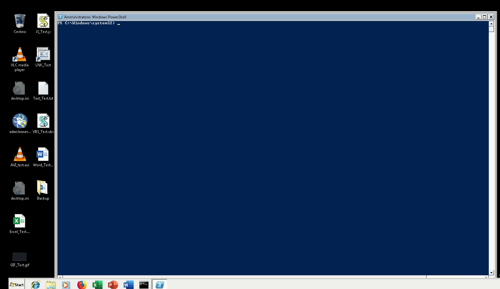
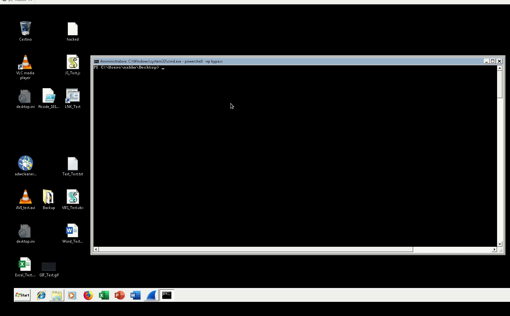

# FTdecryptor

Following some real episodes of plain text body intercepted through Suricata signatures, I developed this simple password based script to easily decrypt data encrypted with FTCODE ransomware.

**Note #1**: *this must be considered a beta version of the script; the author assumes no responsibility for any damage caused by running it.*

**Note #2**: *currently the malware sends the password both as plain and cypher text; we believe the behavior may change soon as the malware is updated, and the plain text form may* not be available anymore.*

**Note #3**: *decrypting files with an incorrect password may make them unrecoverable; so, we recommend taking a backup of the files before running the script.*

## Intercept the body of the POST

### Requests received by the FTCODE C&C server 

```
10.100.100.12 - - [23/Oct/2019 03:26:38] "GET /?need=aegzfej&vid=leg1& HTTP/1.1" 200 -
10.100.100.12 - - [23/Oct/2019 03:26:47] "POST / HTTP/1.1" 200 -
ver=1018.1&vid=leg1&guid=507df552-5c4b-4d38-a486-0c721e84abdb&ext=10b15d&ek=fumgTalOYphVc1RntCG2vQrU4AeBHIb7wFJo9LDMxE3k6sj0S5&r1=UjVUZHd5ekpXbThoTkprc0VZbTBNM25vdkNYTFpYdFpCdnYxZkM1TTY2MDZ0enZ1NFEvVVIxVzk5ZTVscnJwNkx0Y1FIbnVwOFRoeStzclhWWURaWGdjZ0pzYjdGL3U5MHVPcjViTUdIeGRsQTA2VnFINGNNenlQaHNKMWRuV05wOUxjcGZ2czVRQUNSSTRZRkY3R3BaOHluSnlVOVRiN3FHcENvb2dWYk5vPTthWDdHZVNvOVozT1dGdCtMRDhBeG9RTXZFU3YwUjBXWHBNbGd0S08yd3JVNUNTeXhIamZtMldOUytGMkZjdnVwTXE1bWU5T09VNkNvS0dpTnZ5bmNWZGZsdUZld2p2cVdHbEwwN0E3bW5xbEVXT3pCMXlETml3SEwzcGxqR0RrN2JmQklhMytmc1c2bGFxZXlqc053SUkwNE8zTXNueHJGSVpUQXhJem50Qms9&
10.100.100.12 - - [23/Oct/2019 03:26:47] "POST / HTTP/1.1" 200 -
ver=1018.1&vid=leg1&guid=507df552-5c4b-4d38-a486-0c721e84abdb&status=start
10.100.100.12 - - [23/Oct/2019 03:27:58] "POST / HTTP/1.1" 200 -
ver=1018.1&vid=leg1&guid=507df552-5c4b-4d38-a486-0c721e84abdb&status=done&res=28
```

### Complete POST HTTP request containing the password

```
POST / HTTP/1.1
Content-Type: application/x-www-form-urlencoded
Host: pta.bsspta.com
Content-Length: 591
Expect: 100-continue
Connection: Keep-Alive

ver=1018.1&vid=leg1&guid=507df552-5c4b-4d38-a486-0c721e84abdb&ext=10b15d&ek=fumgTalOYphVc1RntCG2vQrU4AeBHIb7wFJo9LDMxE3k6sj0S5&r1=UjVUZHd5ekpXbThoTkprc0VZbTBNM25vdkNYTFpYdFpCdnYxZkM1TTY2MDZ0enZ1NFEvVVIxVzk5ZTVscnJwNkx0Y1FIbnVwOFRoeStzclhWWURaWGdjZ0pzYjdGL3U5MHVPcjViTUdIeGRsQTA2VnFINGNNenlQaHNKMWRuV05wOUxjcGZ2czVRQUNSSTRZRkY3R3BaOHluSnlVOVRiN3FHcENvb2dWYk5vPTthWDdHZVNvOVozT1dGdCtMRDhBeG9RTXZFU3YwUjBXWHBNbGd0S08yd3JVNUNTeXhIamZtMldOUytGMkZjdnVwTXE1bWU5T09VNkNvS0dpTnZ5bmNWZGZsdUZld2p2cVdHbEwwN0E3bW5xbEVXT3pCMXlETml3SEwzcGxqR0RrN2JmQklhMytmc1c2bGFxZXlqc053SUkwNE8zTXNueHJGSVpUQXhJem50Qms9&
```

### Basic suricata signature example

```
alert http $HOME_NET any -> $EXTERNAL_NET any (msg:"CERTEGO TROJAN FTCODE Registration Request (m.bompani)"; flow:to_server; content:"POST"; http_method; content:"ext="; http_client_body; content:"guid="; http_client_body; content:"ek="; http_client_body; classtype:trojan-activity; sid:9000931; rev:1;)
```

## Function Usage

### Tool Help

**SYNOPSIS**

```
Once the FTcode password (ek) is intercepted in the http post request it is possible to decrypt the files through this simple function.

Authors: Gabriele Pippi (@gabriele_pippi)
License: AGPL-3.0
General Requirements: encryption password is required
Required pwsh Dependencies: None
Optional pwsh Dependencies: None
Tested on Version 1018.1
```

**PARAMETER Force**

```
[Warning] In case there is any error during the decryption process all files will become unrecoverable.
Tries to decrypt without backing up files.
This parameter is mutually exclusive with BackupPath.
```

**PARAMETER BackupPath**

```
Specifies the directory where the encrypted files will be backed up. Default = (get-location).Path + '\BACKUPftdecryptor_' + (get-date).tostring("MM-dd-yyyy")
This parameter is mutually exclusive with Force.
```

**PARAMETER Log**

```
Enables tool logging, it requires the Verbose switch option.
```

**PARAMETER LogPath**

```
Specifies the full path to the log file, it requires the Log switch option. Default = (get-location).Path + '\ftdecryptor_'+ (get-date).tostring("MM-dd-yyyy") + '.log'
```

**PARAMETER Extension**

```
Specifies the mandatory extension used by FTcode to rename files. It is currently used to identify possible infected files.
In the observed samples the extension is passed in the "ext" parameter contained in the body of the  plain text post concerned.    
```

**PARAMETER Pass**

```
Specifies the mandatory password used by FTcode to encrypt files.
In the observed samples the extension is passed in the "ek" parameter contained in the body of the plain text post concerned.
At Certego we intercept the requests in question on the networks monitored through a suricata signature.
```

**PARAMETER Path**

```
Specifies the optional path to restrict the scope of encrypted files to be recovered. The path is analyzed recursively.
If the path parameter is not specified, all the disks will be recursively checked.
```

**PARAMETER MinFreeDiskSpace**

```
 Changes the parameter to skip all the disks with less free bytes of the inserted integer.
 Default = 50000 free bytes.
 This parameter is checked only if the path parameter has not been specified.
```

 **PARAMETER MaxByteSize2Decrypt**

```
[WARNING] Incorrectly changing this parameter may make the files unrecoverable.
Specifies the optional parameter that allows you to change the maximum number of bytes to be decrypted.
This parameter was only added for possible code changes by malware authors.
```

### It is recommended to read the help before use

```
Invoke-Expression ((New-Object System.Net.WebClient).DownloadString('https://raw.githubusercontent.com/certego/ransomware_decryptors/master/FTdecryptor/FTdecryptor.ps1')); Get-Help invoke-FTdecryptor -Full
```

### In-memory function delivery

```
Invoke-Expression ((New-Object System.Net.WebClient).DownloadString('https://raw.githubusercontent.com/certego/ransomware_decryptors/master/FTdecryptor/FTdecryptor.ps1')); Invoke-FTdecryptor.ps1 -Verbose -Pass <ek> -Extension <ext> -Log -Path C:\Users\<Username>
```

### Execution via file

```
powershell -ExecutionPolicy Bypass -Command "Import-Module -Name .\FTdecryptor.ps1; Invoke-FTdecryptor -Verbose -Pass <ek> -Extension <ext> -Log"
```

## Examples

### FTdecryptor basic usage




### FTdecryptor backup and log features



![Video]https://raw.githubusercontent.com/certego/ransomware_decryptors/master/FTdecryptor/FTdecryptor_backup_and_log_test.webm)

### FTCODE v1018.1  patched decrypted


## Tests

**Suricata:**

To perform a quick test on suricata we recommend using the FTCODE_v1018.1_full.pcapng file.

**FTCODE encryption:**

To replicate the FTCODE encryption you can use the following function:

**[Warning] this function should only be used for testing purposes**

```
Invoke-Expression ((New-Object System.Net.WebClient).DownloadString('https://raw.githubusercontent.com/certego/ransomware_decryptors/master/FTdecryptor/Tests/only4testFTencryptor.ps1')); Invoke-FTencryptor -Verbose -Path C:\Users\<Users>\Desktop\<path2encrypt>
```
